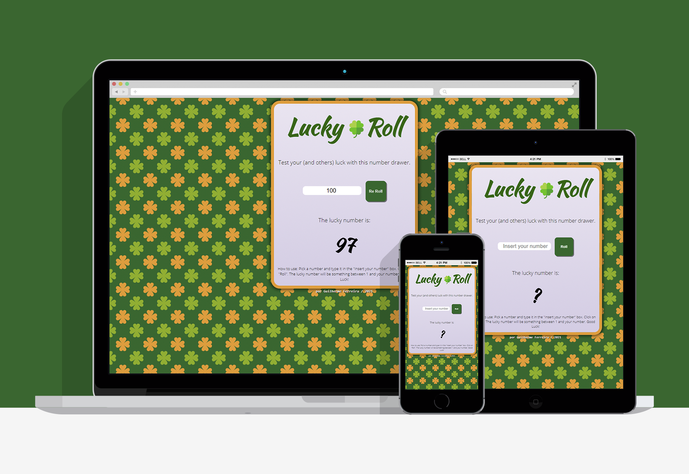

# | Lucky Roll 
## Project created for the ProgramadorBR's WebDev FullStack course.
### The project's proposal was to create a prize draw page where the user should input a number so the systen could, randomly, draw a number between 1 and the input. It was pretty fun to code this project, so I hope you have fun taking a look at it. :)

<br><br>

# | Screenshot


<br>

# | Live View
[Lucky Roll Live](https://guilhermerera.github.io/lucky_roll%20(html5%20css3%20js)/)

<br>

# | Built With
     

<br>

# | What I learned
How to integrate random numbers with user input via JS. And how HTML, CSS and JS can work together and how to create visual feedback with CSS and JS.

This is how I made the button feedback:
- CSS
```css
.btn {
    margin: 0px;
    border: none;
    border-radius: 10px;
    background-color: #346630;
    color: whitesmoke;
    font-weight: 700;
    display: inline-block;
    width: 70px;
    height: 70px;
    box-shadow: 3px 3px rgba(0, 0, 0, 0.5);
}

.btn:hover {
    box-shadow: 3px 3px rgba(0, 0, 0, 0.7)
}

.btn:active {
    position: relative;
    top: 3px;
    left: 3px;
}
```
- JS
```js
} else {
    bD.innerHTML = "Re Roll"
    printinscreen()
}
```


<br>

# | Find Me
[](https://www.linkedin.com/in/guilherme-ferreira-6841b023/) [](mailto:guilhermerera@gmail.com) [](https://github.com/guilhermerera)
